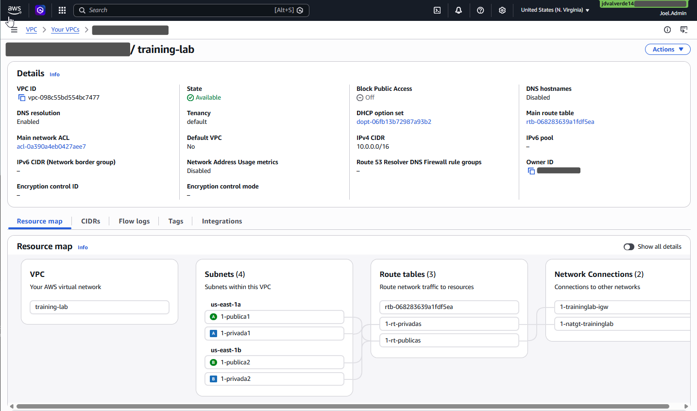

---
tags:
  - aws
  - vpc
  - practitioner
date: 2026-04-17
---
# 01 - Configuración de la VPC

## Objetivo
Crear la red base del lab en AWS mediante una VPC personalizada con subredes públicas y privadas, conectividad a Internet y salida controlada para recursos privados.
## Componentes configurados
- VPC `training-lab`
- Subred pública 1 (`us-east-1a`)
- Subred pública 2 (`us-east-1b`)
- Subred privada 1 (`us-east-1a`)
- Subred privada 2 (`us-east-1b`)
- Internet Gateway
- Route table pública
- Route table privada
- NAT Gateway

## Arquitectura

## Configuración realizada

### 1. Creación de la VPC 🛜
Se creó la VPC `training-lab` con el bloque CIDR `10.0.0.0/16` y tenancy `default`. Esta VPC será la base de red para los recursos del laboratorio.

### 2. Creación de subredes 
Se crearon cuatro subredes distribuidas en dos zonas de disponibilidad: `us-east-1a` y `us-east-1b`. La separación entre subredes públicas y privadas permite organizar mejor la conectividad y la seguridad de la arquitectura.

### 3. Asociación del Internet Gateway
Se creó el Internet Gateway `1-traininglab-igw` y luego se adjuntó a la VPC `training-lab`. Este componente permite la comunicación entre las subredes públicas e Internet.

### 4. Configuración de tablas de enrutamiento
Se creó una route table pública y una privada. La tabla pública se asoció a las subredes públicas y se configuró con la ruta `0.0.0.0/0` hacia el Internet Gateway; la tabla privada se asoció a las subredes privadas para gestionar la salida a Internet a través del NAT Gateway.

### 5. Creación del NAT Gateway
Se aprovisionó un NAT Gateway en la subred pública 1 y se le asignó una Elastic IP. Esto permite que las subredes privadas tengan salida a Internet sin exponer directamente sus recursos.

## Datos técnicos relevantes

| Recurso          | Nombre              |      CIDR       |     Zona     |
| ---------------- | ------------------- | :-------------: | :----------: |
| VPC              | `training-lab`      |  `10.0.0.0/16`  | `us-east-1`  |
| Subred pública 1 | `publica1`          | `10.0.100.0/24` | `us-east-1a` |
| Subred pública 2 | `publica2`          | `10.0.200.0/24` | `us-east-1b` |
| Subred privada 1 | `privada1`          |  `10.0.1.0/24`  | `us-east-1a` |
| Subred privada 2 | `privada2`          |  `10.0.2.0/24`  | `us-east-1b` |
| IGW              | `1-traininglab-igw` |        -        |      -       |
| NAT Gateway      | `nat-gateway-pub1`  |        -        | `us-east-1a` |
## Aprendizajes
- Una VPC define el espacio de red lógico de los recursos en AWS.
- Las subredes públicas requieren ruta hacia un Internet Gateway.
- Las subredes privadas pueden salir a Internet mediante un NAT Gateway.
- Separar recursos por capas mejora orden y seguridad.

## Resultado
Quedó implementada la red base del laboratorio con segmentación pública/privada y conectividad preparada para los siguientes recursos, como instancias EC2 y reglas de seguridad.

## Siguiente etapa
Configurar Security Groups y desplegar instancias dentro de las subredes correspondientes.

---
*Joel David Gonzalez - AWS Practitioner Lab - 17/04/2026*