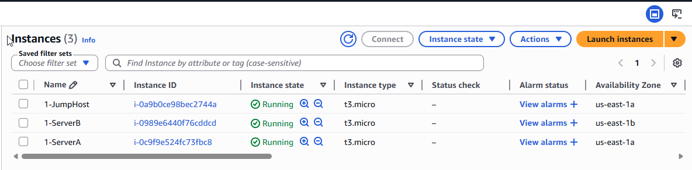
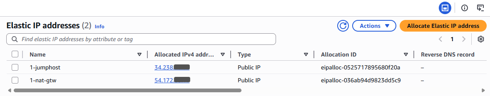
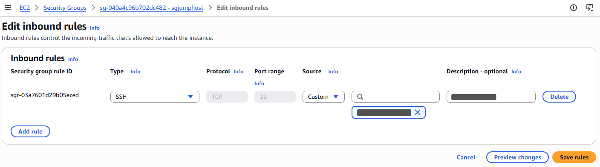
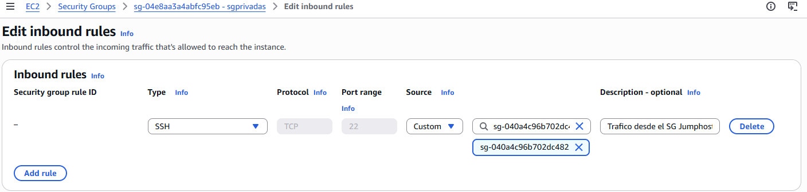
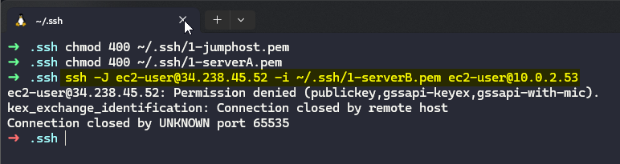
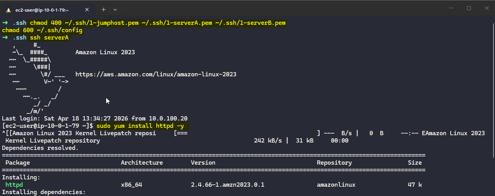
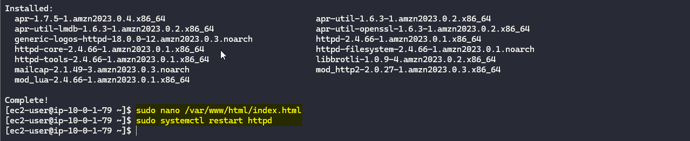

---
tags:
  - aws
  - practitioner
  - lab
date: 2026-04-18
---

# 01 - Configuración de instancias y Proxy-jump

## Objetivo
Implementar un esquema de acceso seguro hacia instancias privadas dentro de una VPC en AWS mediante un `Jumphost`, aplicando reglas de red restrictivas y una configuración SSH desde la máquina local para administrar correctamente las llaves de acceso a cada servidor.

## Componentes configurados
- `ServerA`
- `ServerB`
- `Jumphost`
- `sgjumphost`
- `sgprivadas`

## Arquitectura


Conceptos clave:
- **Jumphost**: instancia ubicada en una subred pública que actúa como punto de entrada controlado hacia recursos alojados en subredes privadas.
- **Claves SSH**: pares de llaves utilizados para autenticar el acceso a cada instancia sin exponer credenciales en texto plano.
- **ProxyJump / archivo config**: mecanismo de OpenSSH que permite definir el salto a través del `Jumphost` y asociar la llave correcta para cada destino.

## Configuración realizada

### 1. Creación de instancias `ServerA`, `ServerB` y `Jumphost`

Se crean las instancias `ServerA` y `ServerB` en subredes privadas, con el objetivo de que no queden expuestas directamente a Internet. Para ambas se asocia el security group `sgprivadas` y se generan sus respectivas llaves privadas para la autenticación por SSH.



Posteriormente, se crea la instancia `Jumphost` en la subred pública `publica1`. A esta instancia se le asocia el security group `sgjumphost` y una **Elastic IP**, ya que será el único punto de entrada administrativo desde el exterior hacia los servidores privados.



### 2. Configuración de reglas en los Security Groups

En el security group `sgjumphost` se configura una regla de entrada que permite conexiones SSH únicamente desde la IP pública de la máquina administradora. De esta manera, el acceso al bastion queda limitado a un origen específico.



En el security group `sgprivadas` se define la regla de entrada para permitir tráfico SSH solo desde el security group `sgjumphost`. Esto asegura que `ServerA` y `ServerB` no acepten conexiones directas desde Internet y solo puedan ser alcanzados a través del `Jumphost`.



Este diseño mantiene el **principio de mínimo acceso**: el servidor público funciona como punto de administración, mientras que las instancias privadas permanecen aisladas del exterior.

### 3. Acceso a las instancias privadas mediante `Jumphost`

Inicialmente, el laboratorio se había planteado con una conexión directa mediante un comando SSH con salto manual a través del `Jumphost`. Sin embargo, durante la implementación fue necesario ajustar el procedimiento, ya que cada servidor privado utilizaba su propia llave y la conexión requería definir explícitamente qué identidad debía usar el cliente SSH en cada caso, por tanto el comando de conexión directa fallaba.



Por esta razón, en lugar de depender de un comando manual para cada acceso, la solución final consistió en crear un archivo `~/.ssh/config` en la máquina local. Esto permitió declarar de forma ordenada el host bastion, los hosts privados, el usuario de conexión, la llave correspondiente a cada instancia y la relación de salto entre ellos.

#### 3.1 Ajuste de permisos de las llaves privadas

Antes de utilizar las llaves SSH, estas se enviaron y almacenaron en una carpeta del sistema Linux llamada `~/.ssh` en la cual se garantiza que se restringen sus permisos en la máquina local para que solo el usuario propietario pueda leerlas.

```bash
chmod 400 ~/.ssh/1-jumphost.pem
chmod 400 ~/.ssh/1-serverA.pem
chmod 400 ~/.ssh/1-serverB.pem
```

#### 3.2 Definición del archivo `~/.ssh/config`

Con la ayuda del comando `nano` se crea el archivo `config` de configuración SSH para declarar el `Jumphost` y los servidores privados como alias reutilizables, se define lo siguiente.

```ssh
Host bastion
    HostName IP-PUBLICA-JUMPHOST
    User ec2-user
    IdentityFile ~/.ssh/1-jumphost.pem

Host serverA
    HostName IP-PRIVADA-SERVERA
    User ec2-user
    IdentityFile ~/.ssh/2-serverA.pem
    ProxyJump bastion

Host serverB
    HostName IP-PRIVADA-SERVERB
    User ec2-user
    IdentityFile ~/.ssh/3-serverB.pem
    ProxyJump bastion
```

Con esta configuración, el cliente SSH resuelve automáticamente el salto a través del `Jumphost` y utiliza la llave correcta según el servidor de destino.

#### 3.3 Conexión a `ServerA` y `ServerB`

Una vez definido el archivo de configuración, el acceso a cada servidor privado se realiza desde la máquina local utilizando alias simples:

```bash
ssh serverA
ssh serverB
```


Este enfoque mantiene la lógica del `Jumphost`, pero mejora la operación al evitar comandos extensos y reducir errores relacionados con rutas, usuarios o llaves privadas.

### 4. Instalación y validación del servicio web

Una vez establecida la conexión con cada instancia privada, se instala Apache como servidor web.

```bash
sudo yum install httpd -y
```



Luego se crea o edita el archivo principal del sitio:

```bash
sudo nano /var/www/html/index.html
```

Después, se habilita e inicia el servicio:

```bash
sudo systemctl enable httpd
sudo systemctl restart httpd
```



Este mismo procedimiento se repite en `ServerA` y `ServerB`, con el fin de validar que ambas instancias pueden ser administradas correctamente a través del `Jumphost`.

### 5. Validación final

Como validación técnica, se comprueba que:
- la conexión SSH hacia `ServerA` y `ServerB` se realiza desde la máquina local usando el archivo `~/.ssh/config`,
- el salto se ejecuta a través del `Jumphost`,
- y el servicio Apache queda instalado y operativo en ambas instancias privadas.


## Datos técnicos relevantes

| Recurso | Nombre | CIDR | Zona |
| --- | --- | --- | --- |
| Instancia pública | `Jumphost` | `publica1` | `us-east-1a` |
| Instancia privada | `ServerA` | `privada1` | `us-east-1a` |
| Instancia privada | `ServerB` | `privada2` | `us-east-1b` |
| Security Group público | `sgjumphost` | `SSH desde mi IP` | `-` |
| Security Group privado | `sgprivadas` | `SSH desde sgjumphost` | `-` |

## Aprendizajes
- Un `Jumphost` permite administrar instancias privadas sin exponerlas directamente a Internet.
- Aunque el laboratorio se planteó como una conexión SSH directa con salto manual, en la práctica fue más confiable definir el acceso mediante `~/.ssh/config`.
- Separar las llaves por servidor y declararlas explícitamente en la configuración SSH ayuda a evitar errores de autenticación.
- La arquitectura inicial no cambió; lo que cambió fue la forma de operar el acceso de manera más clara, ordenada y reproducible.

## Resultado
Se implementó correctamente el acceso administrativo a dos instancias privadas dentro de una VPC de AWS mediante un `Jumphost`. La solución final quedó operativa desde la máquina local usando un archivo `~/.ssh/config`, lo que permitió gestionar de forma consistente el salto y la autenticación hacia cada servidor.

## Siguiente etapa
Como siguiente mejora, este laboratorio puede ampliarse con:
- transferencia de archivos mediante `scp` utilizando los mismos alias definidos en `~/.ssh/config`,
- automatización de configuración inicial con scripts,
- o publicación de contenido web a través de un balanceador de carga interno o público.

---
*Joel David Gonzalez - AWS Practitioner Lab - 18/04/2026*
