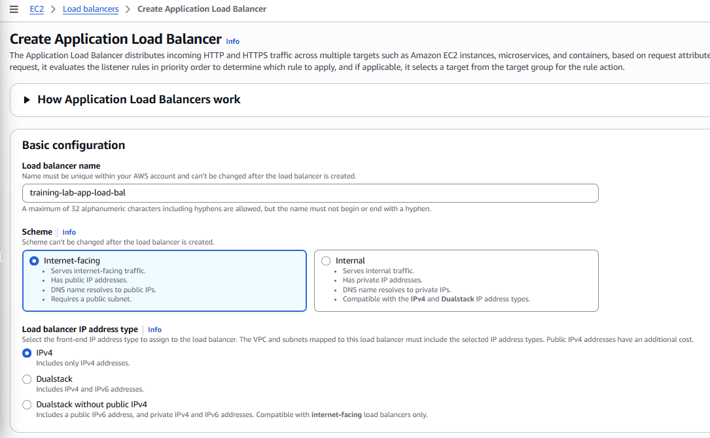
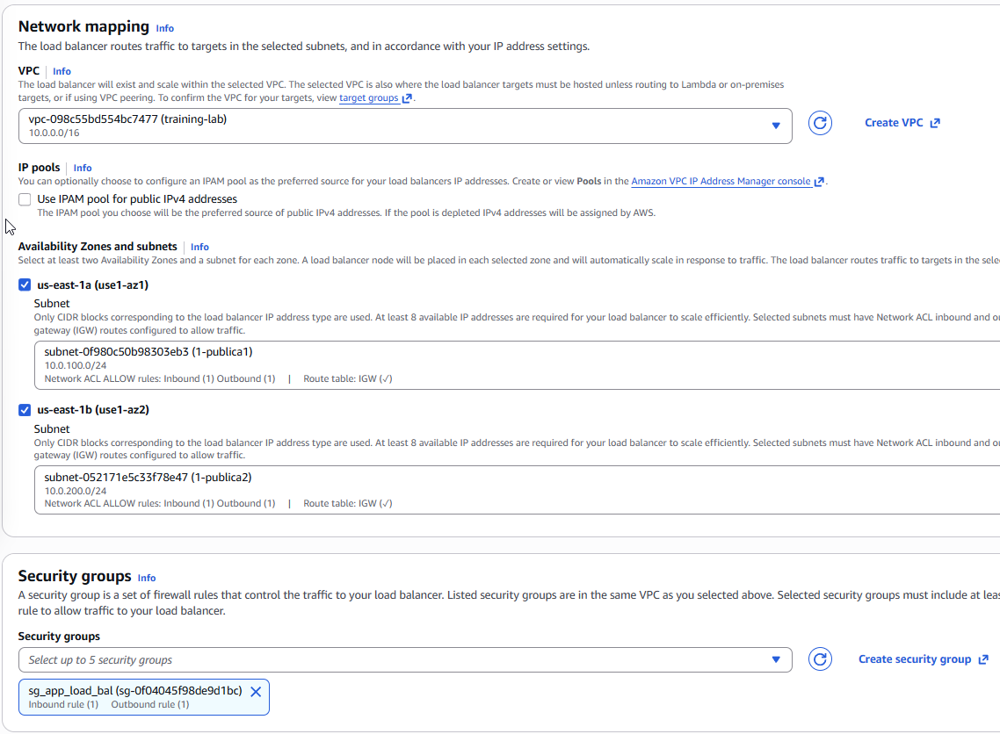
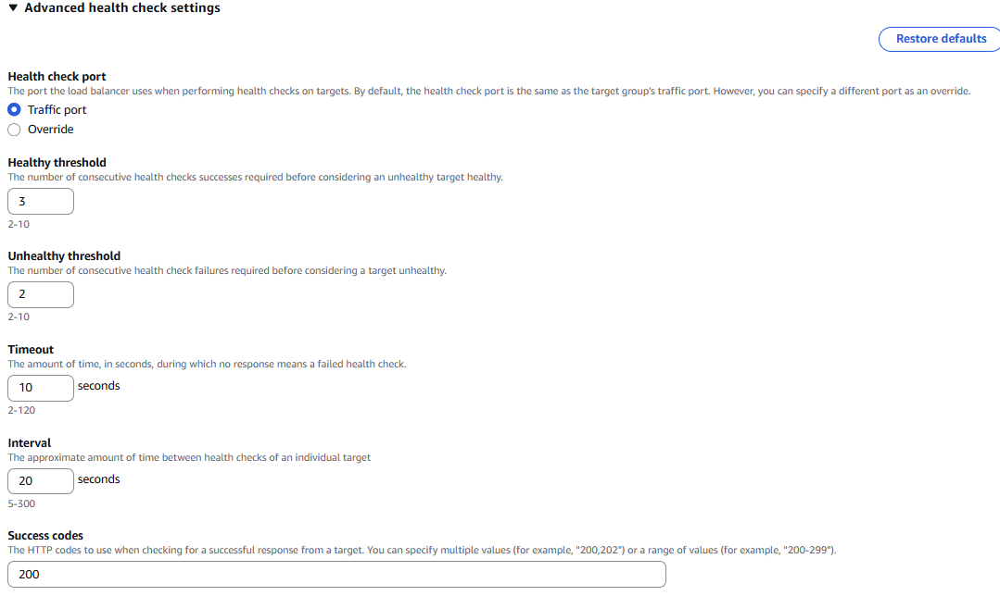
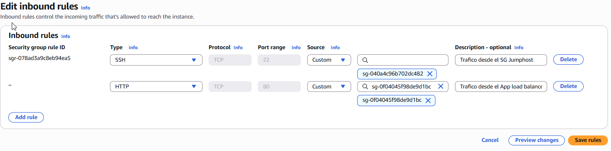
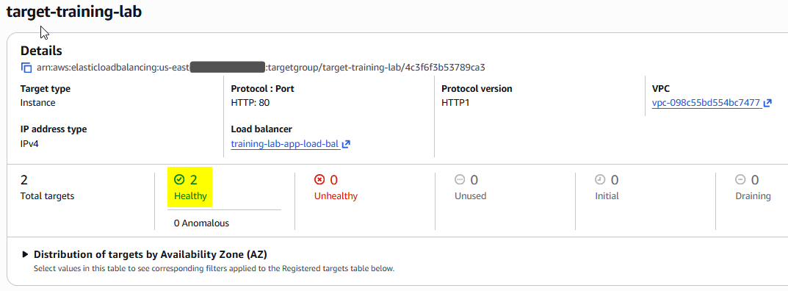
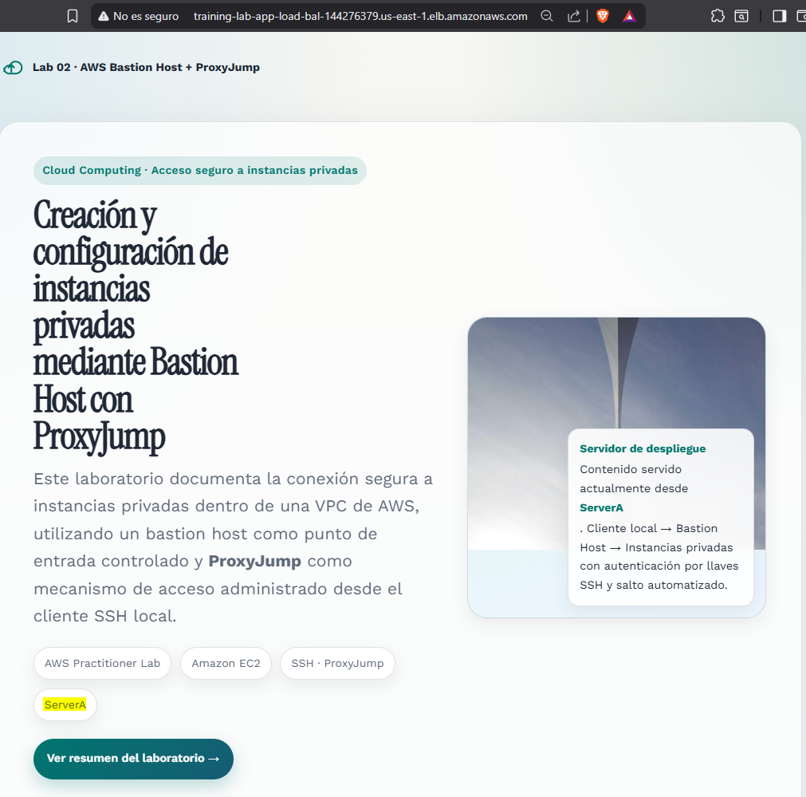
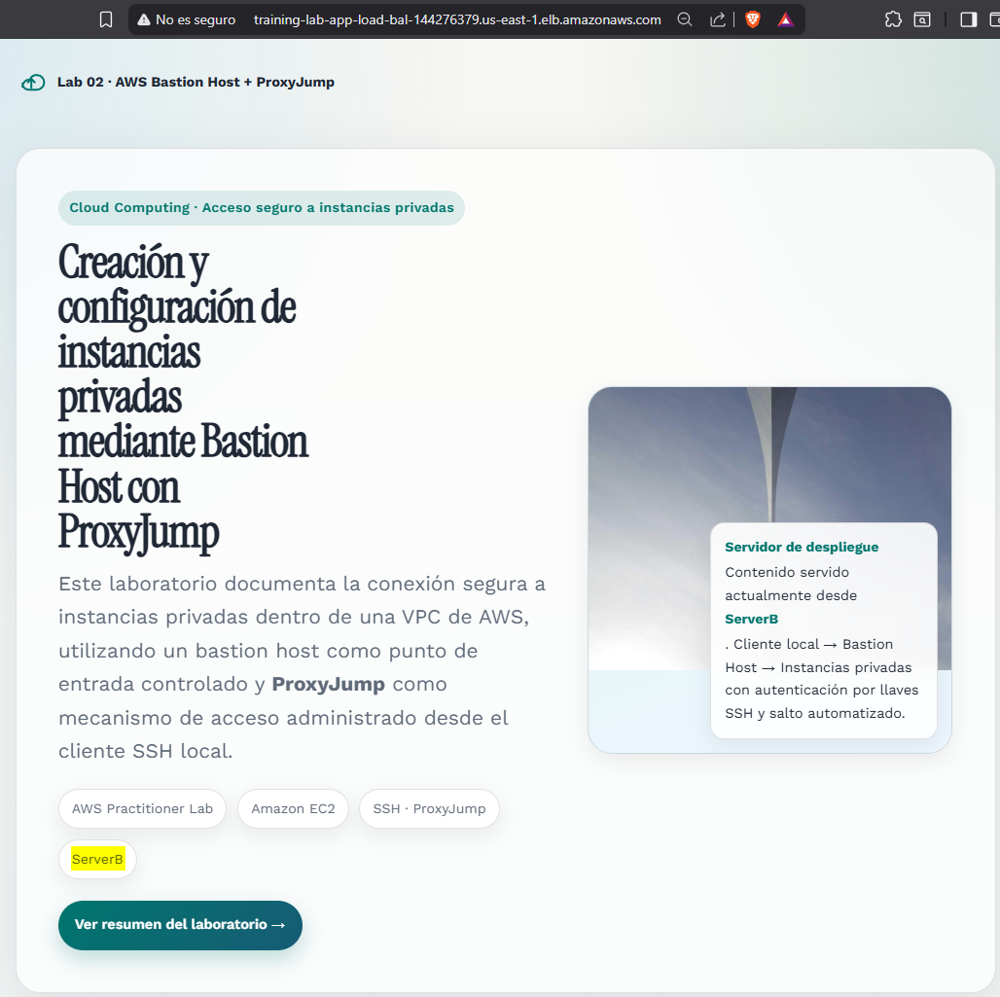

---
tags:
  - aws
  - practitioner
  - aplication-load-balancer
  - target-group
date: 2026-04-18
---

# 03 - Configuración de Balanceador de Carga

## Objetivo
El objetivo de esta etapa del laboratorio es implementar un **Application Load Balancer (ALB)** para distribuir el tráfico HTTP entre dos instancias EC2 privadas configuradas previamente con Apache. Con esta configuración se busca mejorar la disponibilidad de la aplicación, centralizar el punto de acceso y validar un escenario básico de balanceo de carga dentro de una arquitectura desplegada en múltiples zonas de disponibilidad.

## Componentes configurados
- **Application Load Balancer (ALB)**
- **Security Group del balanceador**
- **Target Group**
- **Instancias privadas registradas como destino**
- **Reglas de conectividad para health checks**

## Arquitectura

## Configuración del Balanceador de Carga

### 1. Configuración del esquema, AZs y Security Group
En este laboratorio se seleccionó un **Application Load Balancer** porque el servicio que se desea publicar corresponde a una aplicación web que trabaja con tráfico **HTTP**. Este tipo de balanceador está diseñado para recibir solicitudes web y distribuirlas hacia uno o varios destinos registrados, por lo que resulta adecuado para un escenario con servidores Apache detrás del balanceador.

Se procede a crear el balanceador con el nombre `training-lab-app-load-bal`, definiendo las siguientes opciones iniciales:

- **Scheme:** `internet-facing`
- **IP address type:** `IPv4 only`

Posteriormente, se selecciona la **VPC** del laboratorio y las subredes públicas disponibles en distintas zonas de disponibilidad, en este caso `pública1` y `pública2`. Esta decisión permite que el balanceador quede accesible desde Internet y, al mismo tiempo, quede desplegado de forma distribuida entre múltiples AZ.

A continuación, se crea un **Security Group** para el balanceador que permita tráfico de entrada **HTTP (puerto 80)** desde cualquier origen, es decir, `0.0.0.0/0`. Finalmente, este Security Group se asocia al ALB durante su configuración.

### 2. Configuración del listener y del Target Group
En esta etapa se define el **listener**, que es el componente del balanceador encargado de **escuchar solicitudes entrantes** en un protocolo y puerto específicos. En este caso, se configura un listener para **HTTP en el puerto 80**, ya que ese es el protocolo utilizado por los servidores web desplegados en las instancias privadas.

También se crea el **Target Group**, que es el grupo lógico donde se registran los recursos de destino a los que el balanceador enviará tráfico. En este laboratorio, los destinos registrados son las dos instancias privadas que ejecutan Apache.

Dentro del Target Group se configuran los parámetros de verificación de estado (**health checks**):

- **Healthy threshold: 3**
  Número de verificaciones exitosas consecutivas necesarias para considerar que una instancia está saludable.

- **Unhealthy threshold: 2**
  Número de verificaciones fallidas consecutivas necesarias para considerar que una instancia no está disponible para recibir tráfico.

- **Timeout: 10s**
  Tiempo máximo que el balanceador espera una respuesta del servidor antes de considerar fallida una verificación.

- **Interval: 20s**
  Tiempo entre una verificación de salud y la siguiente para cada destino registrado.

Finalmente, se seleccionan como targets las instancias privadas `privada1` y `privada2`, las cuales actuarán como servidores de destino para el balanceador. Una vez registradas, el ALB podrá enviar tráfico hacia ellas siempre que superen correctamente las verificaciones de salud.

### 3. Permitir al ALB verificar la salud de los servidores privados
Para que el balanceador pueda comprobar el estado de los servidores privados y, posteriormente, enviarles tráfico, es necesario permitir la comunicación entre el ALB y las instancias EC2 registradas en el Target Group.

Para ello, se agrega una **regla de entrada (inbound rule)** en el Security Group asociado a las instancias privadas, permitiendo tráfico **HTTP** desde el Security Group del balanceador `sg_app_load-bal`. Esta configuración es importante porque el ALB necesita acceder al puerto 80 de las instancias para ejecutar los health checks y confirmar que Apache está respondiendo correctamente.

Una vez aplicada esta regla, es posible regresar al **Target Group** y verificar que ambos servidores aparecen en estado **healthy**, lo que indica que ya están disponibles para recibir solicitudes del balanceador.

### 4. Pruebas de acceso con el ALB
Como validación final, se accede al **DNS name** generado automáticamente por el balanceador de carga. Esta dirección se copia en el navegador para comprobar que el tráfico HTTP está siendo distribuido entre ambas instancias configuradas, `serverA` y `serverB`.

Durante la prueba, se verifica que el contenido servido corresponde alternativamente a cada uno de los servidores registrados, confirmando así que el ALB, el Target Group y las reglas de conectividad fueron configurados correctamente.

## Datos técnicos relevantes

| Recurso | Nombre | CIDR / IP | Zona |
| --- | --- | --- | --- |
| Application Load Balancer | `training-lab-app-load-bal` | `Completar` | `Completar` |
| Subred pública 1 | `pública1` | `Completar` | `Completar` |
| Subred pública 2 | `pública2` | `Completar` | `Completar` |
| Instancia privada 1 | `serverA` | `10.0.1.79` | `Completar` |
| Instancia privada 2 | `serverB` | `10.0.2.53` | `Completar` |
| Security Group del ALB | `sg_app_load-bal` | `N/A` | `N/A` |
| Listener | `HTTP:80` | `N/A` | `N/A` |
| Target Group | `Completar nombre` | `N/A` | `N/A` |

## Aprendizajes
- Un **Application Load Balancer** es la opción adecuada cuando se necesita distribuir tráfico **HTTP/HTTPS** hacia servidores web o aplicaciones.
- Un **listener** define el protocolo y el puerto en el que el balanceador recibirá solicitudes entrantes.
- Un **Target Group** agrupa los recursos de destino y permite que el balanceador determine cuáles instancias están disponibles mediante health checks.
- Los **Security Groups** son fundamentales para permitir la comunicación entre el ALB y las instancias privadas.
- Los **health checks** permiten que el balanceador envíe tráfico únicamente a instancias que realmente estén operativas.
- El uso de múltiples subredes públicas en distintas zonas de disponibilidad mejora la resiliencia de la arquitectura.

## Resultado
Como resultado de esta práctica, quedó configurado un **Application Load Balancer público** desplegado en subredes públicas y asociado a un **Target Group** compuesto por dos instancias privadas con Apache. Además, se validó la conectividad entre el ALB y los servidores, la correcta ejecución de los health checks y la distribución del tráfico web entre `serverA` y `serverB`.

## Siguiente etapa
Como siguiente mejora, esta arquitectura podría evolucionar incorporando **HTTPS**, certificados administrados con **AWS Certificate Manager (ACM)**, redirección de HTTP a HTTPS, integración con **Auto Scaling**, y monitoreo mediante métricas y logs para observar con mayor detalle el comportamiento del balanceador y de las instancias registradas.

---
*Joel David Gonzalez - AWS Practitioner Lab - 17/04/2026*
